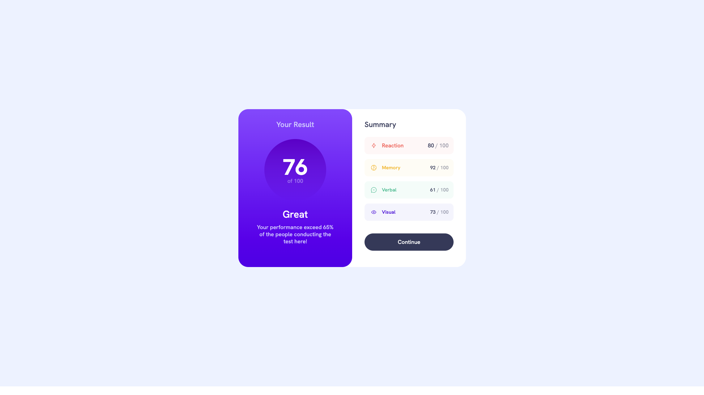
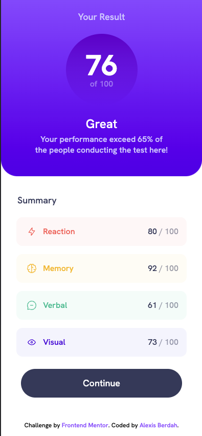

# Kun x Frontend Mentor - Results summary component solution

This is a solution to the [Results summary component challenge on Frontend Mentor](https://www.frontendmentor.io/challenges/results-summary-component-CE_K6s0maV). Frontend Mentor challenges help you improve your coding skills by building realistic projects. 

# Commands
## Installation
`npm install`
## Start project
`npm run start`
## Build project
`npm run build`

# Table of contents

- [Kun Results Summary x Frontend Mentor - Results summary component solution](#kun-results-summary-x-frontend-mentor---results-summary-component-solution)
- [Commands](#commands)
  - [Installation](#installation)
  - [Start project](#start-project)
  - [Build project](#build-project)
- [Table of contents](#table-of-contents)
  - [Overview](#overview)
    - [The challenge](#the-challenge)
    - [Screenshot](#screenshot)
  - [My process](#my-process)
    - [Built with](#built-with)
  - [Author](#author)

## Overview

### The challenge

Users should be able to:

- View the optimal layout for the interface depending on their device's screen size
- See hover and focus states for all interactive elements on the page

### Screenshot

  

## My process

### Built with

- HTML5
- CSS/SASS

## Author

- Frontend Mentor - [@alexisberdah](https://www.frontendmentor.io/profile/alexisberdah)

